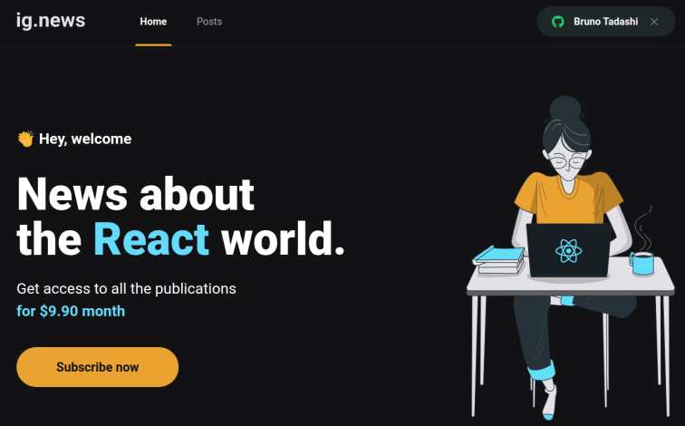
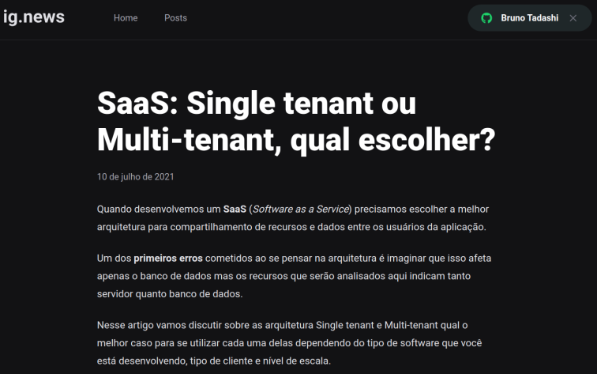

<h1 align="center">Ignews</h1>
<p align="center">ReactJS application developed during Ignite (Rocketseat)</p>

<p align="center">
 <a href="#about">About</a> •
 <a href="#technologies">Technologies</a> •
 <a href="getting">Getting Started</a> •
 <a href="screenshot">Screenshots</a> •
 <a href="#contribution">Contribution</a> •
 <a href="#license">License</a> •
 <a href="#author">Author</a>
</p>

## About
<p align="justify">Ignews is a ReactJS application wich provides text content by subscription.</p>
<h3>Features:</h3>
<ul>
<li>Subscription and authentication</li>
<li>Online payment processing </li>
<li>Create and publish text content</li>
</ul>

## Technologies
The applications's been developed using the following technologies:
- <a href="https://www.typescriptlang.org/">Typescript</a>
- <a href="https://reactjs.org/">ReactJS</a>
- <a href="https://sass-lang.com/">Sass</a>
- <a href="https://fauna.com/">FaunaDB</a>
- <a href="https://stripe.com/br">Stipe</a>
- <a href="https://docs.github.com/en/developers/apps/building-oauth-apps/authorizing-oauth-apps">Github + Oauth</a>

## Getting started
### Requisites
```bash
# Clone this repository
$ git clone https://github.com/btadashi/ignite-ignews.git

# Navigate to the folder 'ignite-ignews'
$ cd ignite-ignews

# Install all dependencies:
$ yarn

# Start application:
$ yarn dev
```

## Screenshots
 <div align="center">
  
  
</div>

## Contribution
1. Fork this repository.
2. Create a new branch with your changes ```git checkout -b my-feature```
3. Commit your changes to the branch ```git commit -m "feature: My feature"```
4. Now just push it ```git push origin my-feature```
5. Submit pull request
## License
This project is under MIT license. 
## Author
This project's been developed by <a href="https://www.linkedin.com/in/bruno-yamaguchi/">Bruno Yamaguchi</a> during Ignite from Rocketseat.
